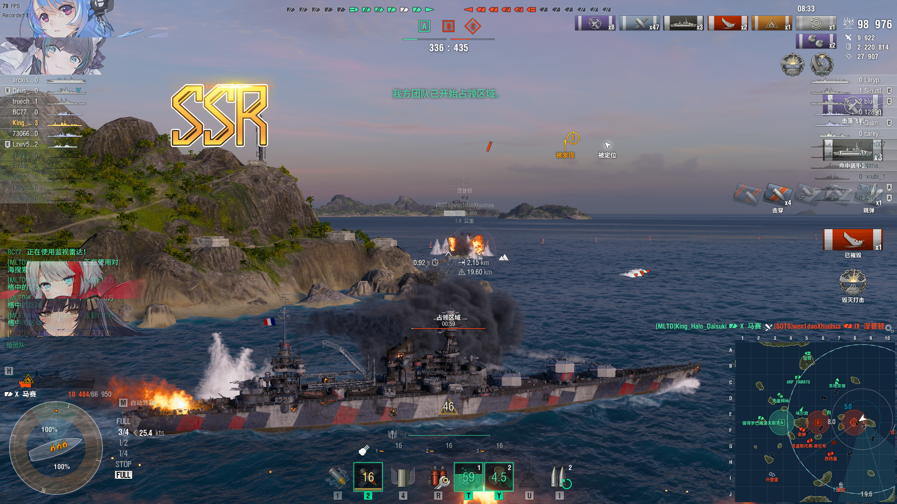

[English](README_EN.md) | [简体中文](README.md)

 

 <strong style="font-size: 36px;">YetAnotherRibbonSystem</strong>

    
    
    

---

[YetAnotherRibbonSystem](https://github.com/AXiX-official/YetAnotherRibbonSystem)是一种全新的战斗反馈系统，重新设计了勋带的呈现方式，并且添加了类鬼泣的实时评分系统（娱乐性质）。

---

## 安装

从[Releases](https://github.com/AXiX-official/YetAnotherRibbonSystem/releases)页面下载最新的`YetAnotherRibbonSystem.zip`，解压到得到`res_mods`文件夹。

导航到游戏安装目录，将`res_mods`文件夹放入其中得到`World of Warships\bin\xxxxxxx\res_mods`这样的路径，其中`xxxxxxx`是`World of Warships\bin\`目录下所有文件夹中数字最大的那个。

如果提示覆盖文件，随意选择。

## 自定义

### 勋带

所有勋带图标都在`YetAnotherRibbonSystem/Ribbons`文件夹中，可以自行替换。

### 评分等级

默认等级从低到高是`N`、`R`、`SR`、`SSR`、`PRY`、`UR`、`DR`（来自碧蓝航线的舰娘稀有度），可以在`YetAnotherRibbonSystem/Level`文件夹中找到，用同名图片替换即可。

> [!NOTE]\
> 评分系统仅供娱乐，不具有实际意义，与实际游戏评分无关\
> 如果你对评分系统有任何建议，欢迎提交Issue

## 感谢

- [mxmeter](https://github.com/qMBQx8GH/mxmeter)

    参考了其代码，以及评分计算。

## Bug & Issue

欢迎提交Bug和Issue，我会尽快解决。

(从这里提交Bug和Issue)[https://github.com/AXiX-official/YetAnotherRibbonSystem/issues]